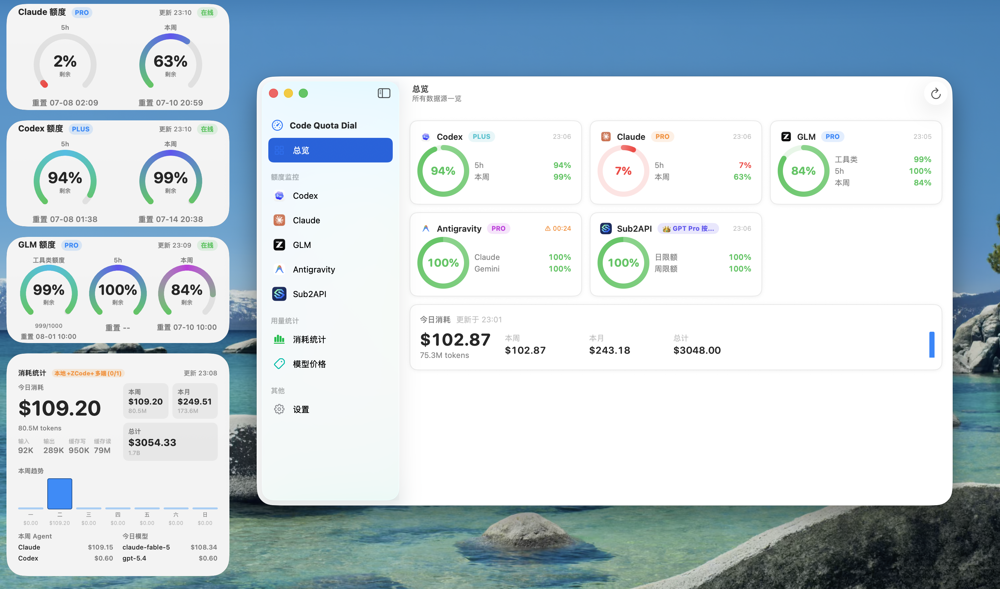

# Code Quota Dial Widget

> 将 **Codex**、**Claude Code**、**GLM（智谱）** 和 **Antigravity** 的额度做成 macOS 桌面组件，支持本地、多端用量联合统计，随时一眼掌握用量。

<p align="center">
  
  
  
</p>

<p align="center">
  
</p>
<p align="center">
  
</p>


---

## 目录

- [功能特性](#功能特性)
- [适用范围](#适用范围)
- [前提条件](#前提条件)
- [快速开始](#快速开始)
- [使用](#使用)
- [工作原理](#工作原理)
- [消耗统计组件](#消耗统计组件)
- [项目结构](#项目结构)
- [本地配置](#本地配置)
- [安装结果](#安装结果)
- [验证安装](#验证安装)
- [常见问题](#常见问题)
- [卸载](#卸载)

---

## 功能特性

- 📊 在 macOS 桌面以表盘组件实时展示 Codex / Claude Code / GLM / Antigravity 额度。
- 📈 额外提供 **消耗统计** 仪表盘组件，基于官方 `ccusage` 展示今日 / 本周 / 本月 / 总计的 token 与费用，支持多端（本机 + 远端 SSH）聚合。
- ⚙️ 完全零配置安装：签名身份 / Team ID / App Group 自动检测，无需手改 Swift、entitlements、`pbxproj` 或任何配置文件。
- 🎛️ 代理与远端 SSH 主机在 app 的「设置」标签页里随时修改，保存即生效，**无需重新安装**。
- 🔁 通过 `LaunchAgent` 定时抓取额度并自动刷新组件。
- 🚀 一条命令完成构建、重签名、安装：`script/install.command`。
- 🧩 五个组件相互独立，缺少某项凭据或本地服务时只影响对应组件，不影响其它。

## 适用范围

这套方案面向：

- 拥有 macOS 设备
- 已安装 Xcode
- 愿意在本机从源码构建

它**不是**“下载一个预编译 app 直接分发给所有人”的方案——每台机器都在本机用自己的签名身份从源码构建。

唯一的人工前提是本机要有一张 Apple Development 签名身份（见[前提条件](#前提条件)，本地自用免费即可）；其余 `Team ID`、App Group、安装路径等全部由脚本自动处理。

## 前提条件

**必需环境：**

| 项目 | 要求 |
| --- | --- |
| 操作系统 | macOS 14+ |
| 构建工具 | Xcode 16+（通过 App Store 下载） |
| **Apple Development 签名身份** | **本机 keychain 中必须有一张可用的 Apple Development 证书（见下方说明）** |
| Node.js | 8.x 及以上（消耗统计组件用 `npx ccusage@latest` 抓取本机数据，缺少则本地 `npx` 无法运行） |

> **关于 Apple Development 签名身份（硬前提）**
>
> 本项目是带 Widget Extension 与 App Groups 的 macOS App，构建、签名、安装每一步都需要签名身份。**一台全新的 Mac 默认没有这个身份**，没有它就无法安装——脚本会直接报错并提示先登录 Xcode。
>
> 获取方式（**本地自用免费即可，无需付费 Apple Developer Program**）：打开 **Xcode → Settings → Accounts**，用任意 Apple ID 登录，Xcode 会自动建立一个 Personal Team 并签发免费的 **Apple Development** 证书。付费 Developer Program 仅在对外分发（公证 / App Store / TestFlight）时才需要，本项目用不到。
>
> 验证本机是否已有：
>
> ```bash
> security find-identity -v -p codesigning
> ```
>
> 只要列出至少一条 `Apple Development: ...` 即可。安装脚本会自动选用它并推导出 `Team ID` 与 App Group，无需手填；仅当列出**多条**时才需用环境变量指定其一（见[本地配置](#本地配置)）。

**可选凭据**（缺少对应项时，仅该组件无法获取数据）：

- **Codex 组件**：本机 Codex 已使用 ChatGPT OAuth 登录，可从 Keychain 读取 `Codex Auth`，或读取 `~/.codex/auth.json`。
- **Claude 组件**：本机 Claude Code 已登录，可从 Keychain 读取 `Claude Code-credentials`。
- **GLM 组件**：在 app 的 **GLM 组件页面**填入 GLM API Key（粘贴时可见，保存后隐藏、不再显示，只标记「已设置」）。Key 存放在运行时配置 `~/Library/Application Support/CodeQuotaDial/runtime-config.json`，可随时在该页面「修改」，无需重装。
- **Antigravity 组件**：本机 Antigravity 已登录并正在运行；当前版本只通过本地 Antigravity language server 获取额度，不做 Google OAuth 云端兜底。

> 旧版本通过 `~/.glm_quota_config.json` 配置 GLM Key，现已**不再读取该文件**，请改用 app 内 GLM 页面填写（可删除旧文件）。
>
> 安全说明：API Key 以明文存于上述 JSON（文件权限 `600`，仅当前用户可读），"保密"指的是**界面不再回显**已保存的 Key，而非磁盘加密。

## 本地配置

**完全零配置：直接运行 `script/install.command` 即可，没有任何配置文件。** 安装脚本会：

- **自动检测签名身份、Team ID、App Group**：从 keychain 里的 Apple Development 签名身份推导（Team ID 用"签一个探针读 TeamIdentifier"的权威方式获取，App Group 按 `<TeamID>.group.local.<name>` 约定生成）。
- **代理 / 远端 SSH 在 app 内配置**：装好后在 app 的「设置」标签页填代理和远端主机，保存后点对应面板「刷新」或等后台自动刷新即可生效，**无需重装**。它们存放在运行时配置 `~/Library/Application Support/CodeQuotaDial/runtime-config.json`（首次安装时若 shell 里已有代理环境变量会自动带入）。
- **安装目录 / 刷新间隔 / PATH** 都有内置默认值。

### 可选：环境变量覆盖

极少数场景需要覆盖默认值时，**用命令行环境变量临时传入**即可（无需任何文件）：

| 环境变量                          | 何时需要                                                     |
| --------------------------------- | ------------------------------------------------------------ |
| `SIGNING_IDENTITY` / `TEAM_ID`    | keychain 里有**多个** Apple Development 身份、自动检测无法判断时（脚本会报错并列出候选） |
| `INSTALL_BASE`                    | 改安装目录（默认 `/Applications`）                           |
| `REFRESH_INTERVAL`                | 改后台刷新间隔秒数（默认 `120`）                             |
| `PATH_PREFIX`                     | 改快照工具的可执行文件查找路径前缀                           |

```bash
# 例：keychain 有多个签名身份时指定其一
SIGNING_IDENTITY="Apple Development: you@example.com (XXXXXXXXXX)" ./script/install.command
# 例：改刷新间隔为 60 秒
REFRESH_INTERVAL=60 ./script/install.command
```

> 远端多端统计：在 app 内「设置」填多个 host（每行一个），每个并发尝试、**只合并连得上的**。要求远端机器**自带 `ccusage`** 且本机到远端**免密 SSH**（key 在 `~/.ssh`、host 已在 `known_hosts`）。
>
> 迁移到另一台机器：直接重新运行 `script/install.command` 即可，无需带任何配置。

## 快速开始

克隆仓库后执行一键安装脚本：

```bash
cd CodeQuotaDialWidget
./script/install.command
```

首次执行会自动完成：

1. 从本机开发身份探测 `Team ID` 与签名身份
2. 生成本机需要的 App Group 配置和 entitlements
3. 构建 App、Widget 以及五个 snapshot tool
4. 使用 `ad-hoc` 方式重签名
5. 安装到 `/Applications/CodeQuotaDialXcode.app`
6. 生成并加载五个 `LaunchAgent`
7. 初始化运行时配置 `runtime-config.json`（代理 / 远端主机，可随后在 app 内「设置」修改）

安装完成后会自动打开 app，接下来按下面的[使用](#使用)说明操作即可。

后续更新代码仓库后，只需重新执行以下任一命令：

```bash
./script/install.command
# 或
./script/rebuild-local.command
```

## 使用

### 1. 打开主窗口

`/Applications/CodeQuotaDialXcode.app`（安装后会自动打开，也可从启动台/聚焦搜索打开）。左侧边栏切换页面：

- **Codex / Claude / GLM / Antigravity**：各自的额度页，展示剩余百分比、重置时间等额度卡片。
- **消耗统计**：基于 `ccusage` 的今日 / 本周 / 本月 / 总计 token 与费用、本周趋势、模型分布。
- **设置**：代理与远端 SSH 主机。

每个额度页右上角有**刷新**按钮（立即拉一次），页内还有**后台自动刷新**开关。

### 2. 首次需要做的配置（都在 app 内，无需重装）

- **GLM**：进 **GLM 页面**，在「API Key」卡片粘贴你的 GLM API Key 后保存（粘贴时可见，保存后隐藏）。
- **代理**（如果你的网络访问 Codex/Claude 接口需要代理）：进 **设置** 页填 `http://127.0.0.1:端口`，保存后回各页点刷新即可生效。
- **远端多端统计**（可选）：进 **设置** 页，在「远端 SSH 主机」每行填一个 host（需免密 SSH 且远端自带 `ccusage`）。

### 3. 添加桌面组件

1. **右键点击桌面**空白处 → 选择 **「编辑小组件」**（或点菜单栏右上角时间打开通知中心，拉到底点「编辑小组件」）。
2. 在左侧小组件库搜索 **Code Quota Dial**。
3. 选择对应组件拖到桌面或通知中心即可。组件每 2 分钟自动读取最新快照。

## 工作原理

```text
LaunchAgent
  -> CodexQuotaSnapshotTool / ClaudeQuotaSnapshotTool / GLMQuotaSnapshotTool / AntigravityQuotaSnapshotTool / UsageQuotaSnapshotTool
  -> 写入 App Group 共享容器中的 JSON 快照
  -> Widget 读取快照并刷新
```

- 宿主 App 负责注册 Widget Extension。
- 各 snapshot tool 负责定时抓取额度/消耗，并调用 `WidgetCenter.shared.reloadAllTimelines()` 触发刷新。

**刷新节奏（两条独立链路，默认都是 2 分钟）：**

| 链路 | 作用 | 周期 |
| --- | --- | --- |
| 数据抓取 | LaunchAgent 定时跑 snapshot tool 拉取 API、写快照（`StartInterval`，由 `REFRESH_INTERVAL` 决定） | 2 分钟（120 秒） |
| 组件重绘 | WidgetKit 重新读取快照并刷新桌面组件（各 widget 的 timeline 周期） | 2 分钟 |

> `REFRESH_INTERVAL` 只控制**数据抓取**，不控制组件重绘；两者现已统一为 2 分钟。WidgetKit 的重绘周期只是"建议值"，系统会按负载节流，实际间隔可能略长——这是 macOS 的限制。App 面板自身打开时也会即时刷新一次，并可手动点「刷新」。

## 消耗统计组件

消耗统计直接利用官方 `ccusage` 接口作为数据源，app/组件只负责展示：

```text
本机:    npx ccusage@latest daily --json    ─┐
远端 1:  ssh <host1> ccusage daily --json   ─┤
远端 N:  ssh <hostN> ccusage daily --json   ─┴─► 按日合并 ─► 本地推导 周/月/总/趋势/模型分布
```

- 周/月/总等都由**一次** `daily` 调用在本地求和得到（不再分别请求），本机与所有远端并发执行。
- 远端为**可选**：在 app 内「设置」标签页填远端 SSH 主机（每行一个，可多个），每个并发尝试、**只合并连得上的**。要求远端机器**自带 `ccusage`** 且本机到远端**免密 SSH**（key 在 `~/.ssh`、host 已在 `known_hosts`）。留空则仅统计本机。
- 任何失败来源都会被自动跳过，只展示已成功合并的来源，并在 app/组件上显式标识：
  - 仅本地成功 → `本地`
  - 本地 + 远端成功数 → `本地+多端(n/m)`
  - 本地失败但远端有成功 → `多端(n/m)`（橙色）
  - 没有可用来源 → `无来源`（橙色）
- 本机通过使用 `npx ccusage@latest` 在线获取，无需下载。

## 项目结构

```text
CodeQuotaDialWidget/
├── Package.swift
├── script/
│   ├── install.command           # 一键构建 + 安装
│   ├── rebuild-local.command     # 重新构建并重签名
│   └── uninstall.command         # 卸载
├── Sources/                      # Core / Widget / SnapshotTool 与共享模块源码
│   ├── QuotaDialWidgetUI/        # 各额度组件共用的表盘 UI
│   └── QuotaProcessSupport/      # snapshot tool 共用的进程执行辅助
├── Runtime/                      # 构建产物与运行日志
└── XcodeApp/                     # 宿主 App 工程
```

`Sources/*Core/AppGroupConfig.generated.swift` 会在本机安装/重建时自动生成，包含当前机器的 App Group 配置，不需要提交到仓库。

## 安装结果

安装成功后会生成以下内容：

```text
/Applications/CodeQuotaDialXcode.app
~/Library/Application Support/CodeQuotaDial/runtime-config.json   # 代理 / 远端主机 / GLM API Key（GLM Key 在 GLM 面板改，其余在「设置」改）
~/Library/LaunchAgents/local.codex-quota-dial.refresh.plist
~/Library/LaunchAgents/local.claude-quota-dial.refresh.plist
~/Library/LaunchAgents/local.glm-quota-dial.refresh.plist
~/Library/LaunchAgents/local.antigravity-quota-dial.refresh.plist
~/Library/LaunchAgents/local.usage-quota-dial.refresh.plist
Runtime/codex/CodexQuotaSnapshotTool
Runtime/claude/ClaudeQuotaSnapshotTool
Runtime/glm/GLMQuotaSnapshotTool
Runtime/antigravity/AntigravityQuotaSnapshotTool
Runtime/usage/UsageQuotaSnapshotTool
```

共享容器中的快照路径：

```text
~/Library/Group Containers/<TeamID>.group.local.codex-token-monitor/codex_quota_snapshot.json
~/Library/Group Containers/<TeamID>.group.local.claude-quota-monitor/claude_quota_snapshot.json
~/Library/Group Containers/<TeamID>.group.local.glm-quota-monitor/glm_quota_snapshot.json
~/Library/Group Containers/<TeamID>.group.local.antigravity-quota-monitor/antigravity_quota_snapshot.json
~/Library/Group Containers/<TeamID>.group.local.usage-quota-monitor/usage_quota_snapshot.json
```

## 验证安装

**1. 确认 LaunchAgent 已加载：**

```bash
launchctl print "gui/$(id -u)/local.codex-quota-dial.refresh"
launchctl print "gui/$(id -u)/local.claude-quota-dial.refresh"
launchctl print "gui/$(id -u)/local.glm-quota-dial.refresh"
launchctl print "gui/$(id -u)/local.antigravity-quota-dial.refresh"
launchctl print "gui/$(id -u)/local.usage-quota-dial.refresh"
```

**2. 确认快照文件已存在：**

```bash
ls ~/Library/Group\ Containers/*codex-token-monitor/codex_quota_snapshot.json
ls ~/Library/Group\ Containers/*claude-quota-monitor/claude_quota_snapshot.json
ls ~/Library/Group\ Containers/*glm-quota-monitor/glm_quota_snapshot.json
ls ~/Library/Group\ Containers/*antigravity-quota-monitor/antigravity_quota_snapshot.json
ls ~/Library/Group\ Containers/*usage-quota-monitor/usage_quota_snapshot.json
```

**3. 手动触发一次刷新：**

```bash
launchctl kickstart -k "gui/$(id -u)/local.codex-quota-dial.refresh"
launchctl kickstart -k "gui/$(id -u)/local.claude-quota-dial.refresh"
launchctl kickstart -k "gui/$(id -u)/local.glm-quota-dial.refresh"
launchctl kickstart -k "gui/$(id -u)/local.antigravity-quota-dial.refresh"
launchctl kickstart -k "gui/$(id -u)/local.usage-quota-dial.refresh"
```

> 若快照文件的修改时间随之前进，说明后台刷新链路正常。

## 常见问题

### 1. 运行 `script/install.command` 后没有生成 widget 数据

先查看日志：

```bash
tail -n 100 Runtime/codex/logs/refresh.err.log
tail -n 100 Runtime/claude/logs/refresh.err.log
tail -n 100 Runtime/glm/logs/refresh.err.log
tail -n 100 Runtime/antigravity/logs/refresh.err.log
```

常见原因：

- 代理未配置正确（在 app 内「设置」标签页填写）。
- Codex 未使用 ChatGPT OAuth 登录，或 Keychain / `~/.codex/auth.json` 中没有可用凭据。
- Claude Code 未登录，或 Keychain 中没有 `Claude Code-credentials`。
- 未在 GLM 组件页面填写 API Key（也没有旧的 `~/.glm_quota_config.json` 后备）。
- Antigravity 未运行，或本地 language server 没有暴露可用的 Connect RPC。
- App Group 容器异常（卸载重装可重置：`script/uninstall.command` 后再 `script/install.command`）。

补充说明：

- 截至 `2026-06-19`，Claude Code 本地保存的 OAuth 访问令牌默认约 `8` 小时过期一次。
- 本项目会在检测到 Claude OAuth 令牌过期或接口返回 `401` 时，尝试通过一次 `claude -p` 触发 Claude Code 刷新本地 OAuth 凭据，然后重试额度拉取。
- 这个刷新动作只用于更新本地登录态，不会产生任何 Claude 使用额度消耗，因此可以用于长期保持额度读取链路可用。

### 2. App 能打开，但 widget 仍是旧数据

先手动 kickstart：

```bash
launchctl kickstart -k "gui/$(id -u)/local.codex-quota-dial.refresh"
launchctl kickstart -k "gui/$(id -u)/local.claude-quota-dial.refresh"
launchctl kickstart -k "gui/$(id -u)/local.glm-quota-dial.refresh"
```

然后检查快照时间是否前进。若快照时间已前进但桌面仍未变化，通常是 WidgetKit 自身的刷新延迟，稍等片刻，或移除后重新添加 widget。

### 3. 换机器后还能直接用吗？

可以，但**必须在新机器上重新运行**：

```bash
./script/install.command
```

因为新机器的 `Team ID`、App Group entitlement、LaunchAgent 路径都可能不同，脚本会按新机器重新检测并构建。前提同样是新机器已有 Apple Development 签名身份（见[前提条件](#前提条件)）。代理 / 远端主机不随仓库迁移，在新机器装好后到 app 内「设置」重新填写即可。

## 卸载

标准卸载：

```bash
./script/uninstall.command
```

开发态全清（含项目构建产物）：

```bash
./script/uninstall.command --include-project-build
```

卸载脚本会清理：

- `/Applications/CodeQuotaDialXcode.app`
- `~/Library/LaunchAgents/local.codex-quota-dial.refresh.plist`
- `~/Library/LaunchAgents/local.claude-quota-dial.refresh.plist`
- `~/Library/LaunchAgents/local.glm-quota-dial.refresh.plist`
- `~/Library/LaunchAgents/local.antigravity-quota-dial.refresh.plist`
- `~/Library/LaunchAgents/local.usage-quota-dial.refresh.plist`
- `~/Library/Group Containers/*codex-token-monitor`
- `~/Library/Group Containers/*claude-quota-monitor`
- `~/Library/Group Containers/*glm-quota-monitor`
- `~/Library/Group Containers/*antigravity-quota-monitor`
- `~/Library/Group Containers/*usage-quota-monitor`
- `Runtime/codex/CodexQuotaSnapshotTool`
- `Runtime/claude/ClaudeQuotaSnapshotTool`
- `Runtime/glm/GLMQuotaSnapshotTool`
- `Runtime/antigravity/AntigravityQuotaSnapshotTool`
- `Runtime/usage/UsageQuotaSnapshotTool`
- `Runtime/*/logs`
- `~/Library/Application Support/CodeQuotaDial`（运行时配置：代理 / 远端主机）
- WidgetKit / Chrono 相关缓存
